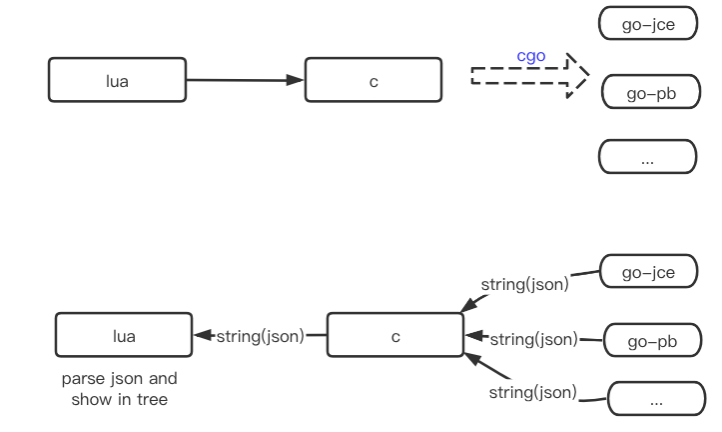

# wireshark_plugin

This is a simple, extensible wireshark universal plug-in solution.

## 本仓库的目标(okr)

- 1 当业务遇到一种业务的字节协议时，可快速在 wireshark 中解析，展示；
- 2 支持使用 go 实现包解析；
- 3 对解析性能要求(1000条/s即可)，准确解析；

## 1 前言

一般来说简单的协议使用 lua 实现即可，但是遇到 pb/thrift 等 tlv 类型的协议就比较麻烦了；
比较友好的是，目前有lua-protobuf 这样的库，可以在lua中解析PB协议, 只需要提供proto即可；

但是对于内部的 tlv 协议，由于本人不太会使用lua去封装c库；

突然萌生了一个想法，能不能用 golang 来开发 wireshark 插件？ 是否可以让 lua5.2 直接调用cgo？

## 2 缘起

1 采用lua可快速实现一个简单的 wireshark 插件，快捷高效，重新加载即可生效，无需编译，可快速调整显示效果，而且官方文档也比较完善。 
但是,在工作中正好有各种各样的 tlv 类型协议接口(历史原因)，lua在tlv类型的协议解析上就显得有点吃力。

2 确定以 lua 为基础，正好业务中对各种 tlv 都有对应的go版本的codec，而且实现新的协议也非常快，能不能直接复用呢？一种方法就是 lua 直接调用cgo (经过初步验证，没有成功)；

于是退一步，折中一下，能不能用 `lua -> c` 然后 `c -> go`, 因为这两个环节是相当成熟的，初步评估可行，于是开始尝试。



## 3 core

core 是这个项目的核心代码，包含lua，c，go代码；

实现了 `lua -> c -> go` 整体流程，定义了跨语言调用的相关接口。

## 4 简单测量解析耗时

```sh
time tshark -r udp_10011.cap >/dev/null
```

### 4.1 Benchmark

```log
记录条数: 96180 条
文件大小: 44 M
报文大小：300 ~ 500 bytes
解析耗时: 9.479s
平均速率: 1 W/s
tshark -r udp.cap > /dev/null  9.05s user 0.94s system 105% cpu 9.479 total
```

## 5 lua_plugins

一些常规的 lua 插件，可供参考学习。

## 6 依赖

- lua 5.2.4 开发环境
- gcc 4.8.5+
- go 1.15+

### 可选用的 lua 第三方库

- [lua-protobuf](https://github.com/starwing/lua-protobuf)
  纯 C 实现的 protobuf (proto2、proto3) lua 库，兼容lua5.1、lua5.2、lua5.3,
  可在lua中进行 pb 协议的codec.

- [json.lua](https://github.com/rxi/json.lua)
  官方介绍： Implemented in pure Lua: works with 5.1, 5.2, 5.3 and JIT.
  lua json codec库。

## 7 QA

- 支持 MacOS

- Q 为什么要基于 lua5.2 开发？

A 前提是在 wireshark 中运行，而 wireshark 提供的是 lua5.2。
当然也可以自动动手编译 wireshark+luaJit的版本， 但是我更想上手即用。
